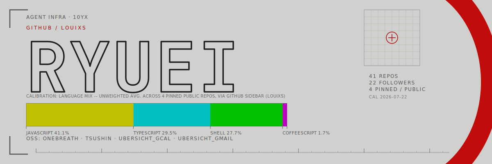
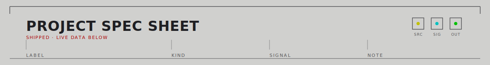
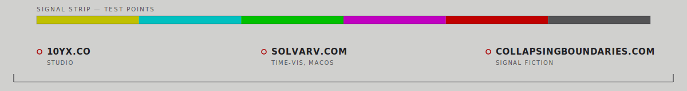

<picture><source media="(prefers-color-scheme: dark)" srcset="./assets/hero-dark.svg"><source media="(prefers-color-scheme: light)" srcset="./assets/hero-light.svg"></picture>

<picture><source media="(prefers-color-scheme: dark)" srcset="./assets/panel2-dark.svg"><source media="(prefers-color-scheme: light)" srcset="./assets/panel2-light.svg"></picture>

<table>
<tr><th align="left">LABEL</th><th align="left">KIND</th><th align="left">SIGNAL</th><th align="left">NOTE</th></tr>
<tr>
<td><code>onebreath</code></td>
<td>Claude Code slash commands</td>
<td></td>
<td><code>/1s</code> / <code>/1p</code> — one sentence or one paragraph, enforced, not suggested</td>
</tr>
<tr>
<td><code>tsushin</code></td>
<td>Übersicht widget</td>
<td></td>
<td>rolling line chart of live upload/download throughput, no deps</td>
</tr>
<tr>
<td><code>ubersicht_google_calendar</code></td>
<td>Übersicht widget</td>
<td></td>
<td>TypeScript rewrite of a CoffeeScript widget, loopback OAuth</td>
</tr>
<tr>
<td><code>ubersicht_gmail</code></td>
<td>Übersicht widget</td>
<td></td>
<td>Gmail counterpart to the calendar widget</td>
</tr>
</table>

<picture><source media="(prefers-color-scheme: dark)" srcset="./assets/panel3-dark.svg"><source media="(prefers-color-scheme: light)" srcset="./assets/panel3-light.svg"></picture>

builds agent infrastructure at <a href="https://10yx.co">10yx</a> · ships small sharp tools
