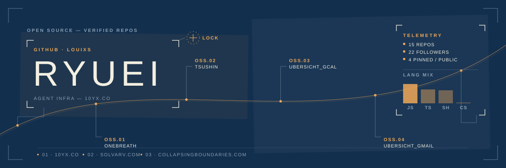
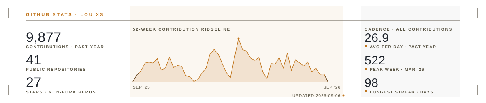
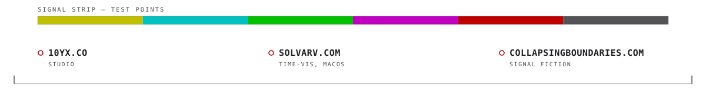

<picture><source media="(prefers-color-scheme: dark)" srcset="./assets/hero-dark.svg"><source media="(prefers-color-scheme: light)" srcset="./assets/hero-light.svg"></picture>

builds agent infrastructure at <a href="https://10yx.co">10yx</a> · ships small sharp tools

<picture><source media="(prefers-color-scheme: dark)" srcset="./assets/stats-dark.svg"><source media="(prefers-color-scheme: light)" srcset="./assets/stats-light.svg"></picture>

<picture><source media="(prefers-color-scheme: dark)" srcset="./assets/panel3-dark.svg"><source media="(prefers-color-scheme: light)" srcset="./assets/panel3-light.svg"></picture>
